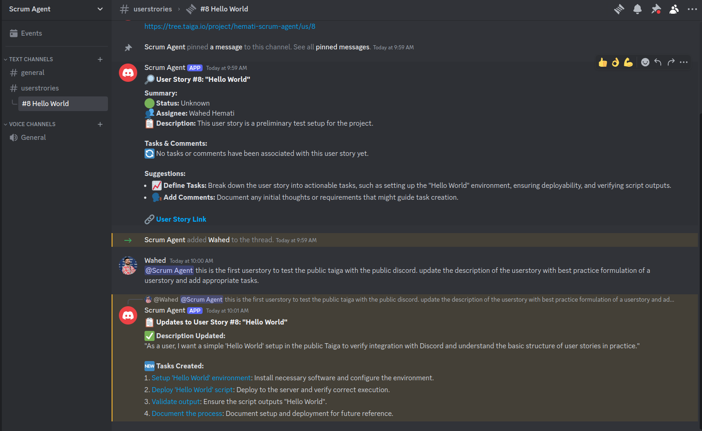
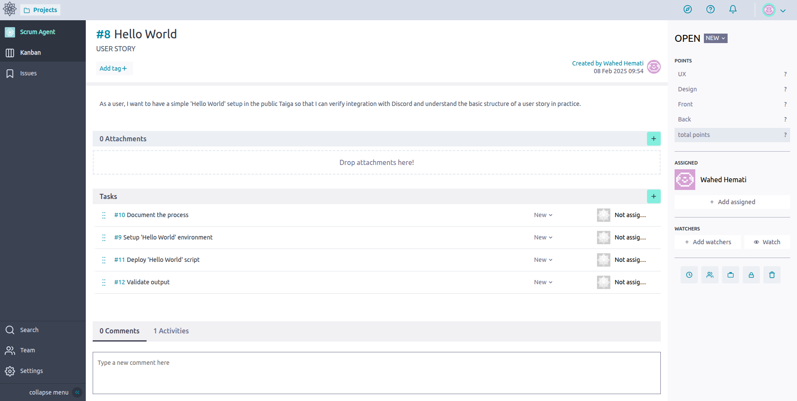
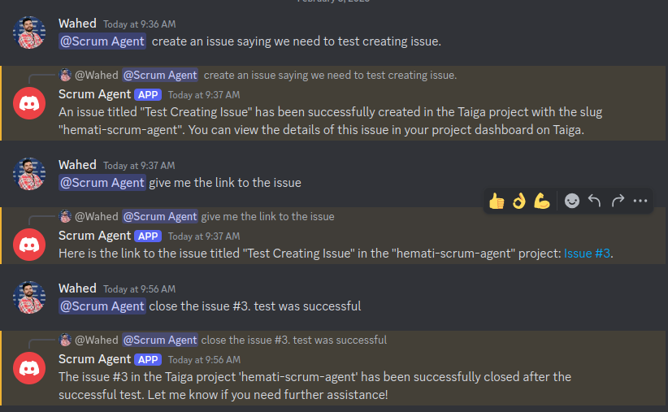
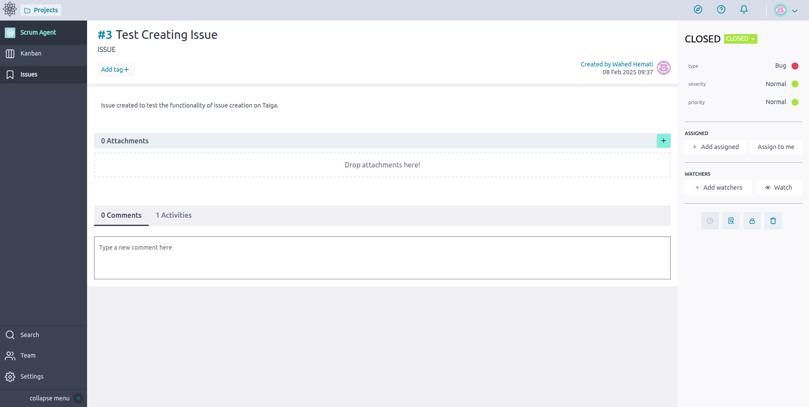

# Scrum Agent


<div align="center">
  <a href="https://discord.gg/ADV99kyfjg" target="_blank" style="margin: 2px;">
    
  </a>
  <a href="https://shikenso.com/" target="_blank" style="margin: 2px;">
    
  </a>
  <a href="https://de.linkedin.com/company/shikenso-gmbh" target="_blank" style="margin: 2px;">
    
  </a>
  <a href="./LICENSE" target="_blank" style="margin: 2px;">
    
  </a>
</div>

---

## Table of Contents

1. [Introduction](#1-introduction)
2. [Features](#2-features)
3. [Architecture](#3-architecture)
4. [Installation and Setup](#4-installation-and-setup)
5. [Running Locally](#5-running-locally)
6. [Environment Variables](#6-environment-variables)
7. [MCP Server Configuration](#7-mcp-server-configuration)
8. [Usage Examples](#8-usage-examples)
9. [Testing](#9-testing)
10. [Tracing with LangSmith](#10-tracing-with-langsmith)
11. [Roadmap](#11-roadmap)
12. [Contact](#12-contact)

---

## 1. Introduction

**Scrum Agent** is an open-source, AI-powered Scrum Master that integrates Discord with Taiga project management. It uses a single ReAct agent powered by LangGraph and connects to external tools via the Model Context Protocol (MCP).

By mapping Discord channels to Taiga projects, Scrum Agent facilitates user story management through threaded discussions, automated stand-ups, and seamless synchronization between both platforms.

Join our [Discord Server](https://discord.gg/ADV99kyfjg) to test the Scrum Agent.

### Project Goals & Audience

Scrum Agent is designed for **small dev teams** without a dedicated Scrum Master, but can also be used by **larger teams** to keep Discord conversations and Taiga boards in sync. The project is under active development — contributions and feedback are welcome.

---

## 2. Features

### Discord Integration
- Automated Discord thread creation for each Taiga user story
- Semantic search over Discord message history (ChromaDB)
- Daily stand-up posts at 08:00 (Berlin time)
- Hourly Taiga-Discord synchronization
- Smart message splitting for Discord's 2000-char limit

### Taiga Project Management
- Retrieve, create, and update user stories, tasks, and issues
- Sprint tracking and status updates
- Watchers and assignee management

### MCP Tool Servers
- **Taiga MCP** — Full Taiga API access via `langchain-taiga`
- **GitHub MCP** — Repository browsing, commits, branches (Docker)
- **Discord Chroma MCP** — Semantic search over Discord messages
- **Discord API MCP** — Direct Discord channel/message operations

### Web Research
- DuckDuckGo search, ArXiv papers, YouTube, Wikipedia

### Multi-LLM Support
- OpenAI (default: `gpt-4o`)
- Anthropic Claude (`claude-sonnet-4-5-20250929`, etc.)
- Ollama local models (`ollama/llama3`, etc.)

### Stand-up Scheduling via Tags

| Tag on Taiga user story | Bot behaviour |
|-------------------------|---------------|
| `daily stand-up`        | Stand-up **every day** |
| `weekly stand-up`       | Stand-up **Mondays only** |
| `no stand-up`           | **No stand-up** |
| _no tag_                | Mondays only (default) |

---

## 3. Architecture

Scrum Agent v2.0 uses a **single ReAct agent** (LangGraph `create_react_agent`) that connects to external tools via MCP (Model Context Protocol). Each MCP server runs as a subprocess and communicates via stdio.

```
Discord Bot (main_discord_bot.py)
  └── ScrumAgent (agent.py)
        ├── LangGraph ReAct Agent
        │     ├── LLM (OpenAI / Anthropic / Ollama)
        │     └── Tools
        │           ├── MCP: Taiga (langchain-taiga)
        │           ├── MCP: GitHub (Docker container)
        │           ├── MCP: Discord Chroma (custom, ChromaDB)
        │           ├── MCP: Discord API (mcp-discord npm)
        │           ├── DuckDuckGo Search
        │           ├── ArXiv
        │           ├── YouTube Search
        │           └── Wikipedia
        └── Checkpointer (MongoDB or MemorySaver)
```

### Key Files

| File | Description |
|------|-------------|
| `scrumagent/agent.py` | Core agent with MCP client and LLM factory |
| `scrumagent/main_discord_bot.py` | Discord bot entry point |
| `mcp_servers/discord_chroma_server.py` | Custom MCP server for semantic Discord search |
| `config/mcp_config.yaml` | MCP server configuration |
| `config/taiga_discord_maps.yaml` | Discord-to-Taiga project mappings |
| `pyproject.toml` | Dependencies and project config |

---

## 4. Installation and Setup

### Prerequisites

- Python 3.10–3.12
- [uv](https://docs.astral.sh/uv/) (Python package manager)
- Docker (for GitHub MCP server)
- Node.js / npm (for Discord API MCP server)

### Install Dependencies

```bash
git clone https://github.com/Shikenso-Analytics/ScrumAgent.git
cd ScrumAgent
git checkout claude/scrumagent-langgraph-mcp-bz738

# Install all dependencies including dev tools
uv sync --all-extras
```

### Configure Environment

```bash
cp .env.example .env
# Edit .env with your credentials (see Section 6)

cp config/taiga_discord_maps.yaml.example config/taiga_discord_maps.yaml
# Edit the mapping file to match your Discord channels and Taiga projects
```

### Discord Bot Setup

1. Go to the [Discord Developer Portal](https://discord.com/developers/applications)
2. Create a new Application and go to the **Bot** tab
3. Enable **Server Members Intent** and **Message Content Intent**
4. In **OAuth2**, enable the **bot** scope with these permissions:
   - View Channels, Send Messages, Read Message History
   - Create Public/Private Threads, Manage Threads, Send Messages in Threads
   - Manage Messages, Add Reactions
5. Use the generated OAuth2 URL to invite the bot to your server
6. Copy the bot token and add it to your `.env` file as `DISCORD_TOKEN`

---

## 5. Running Locally

### Start the Discord Bot (production mode)

```bash
uv run python scrumagent/main_discord_bot.py
```

This starts the Discord bot, which will:
1. Connect to Discord and establish MCP server connections
2. Create/update threads for each active Taiga user story
3. Begin the daily stand-up and hourly sync tasks
4. Listen for messages in configured channels

### Debug a Single Agent Invocation

To test the agent without the Discord bot, use a Python script:

```bash
uv run python -c "
import asyncio
from scrumagent.agent import ScrumAgent
from langchain_core.messages import HumanMessage

async def main():
    agent = ScrumAgent()
    await agent.start()
    print(f'Tools loaded: {len(agent.graph.get_graph().nodes)}')

    result = await agent.ainvoke(
        [HumanMessage(content='List all active user stories in project my-project-slug')],
        {'configurable': {'user_id': 'debug', 'thread_id': 'debug-session'}}
    )
    print(result['messages'][-1].content)

asyncio.run(main())
"
```

### Test Individual MCP Servers

```bash
# Taiga MCP — should print FastMCP banner and start listening
uv run python -m langchain_taiga.mcp_server

# Discord Chroma MCP — starts and waits on stdio
uv run python mcp_servers/discord_chroma_server.py

# GitHub MCP (requires Docker + GITHUB_PERSONAL_ACCESS_TOKEN)
docker run -i --rm -e GITHUB_PERSONAL_ACCESS_TOKEN ghcr.io/github/github-mcp-server

# Discord API MCP (requires npm + DISCORD_TOKEN)
DISCORD_TOKEN=your_token npx -y mcp-discord
```

### Test MCP Tool Loading (without credentials)

```bash
# Verify all 4 web tools load
uv run python -c "
from scrumagent.agent import _build_web_tools
tools = _build_web_tools()
print(f'{len(tools)} tools: {[type(t).__name__ for t in tools]}')
"

# Verify MCP config loads and env vars resolve
uv run python -c "
from scrumagent.agent import _load_mcp_config
config = _load_mcp_config()
for name, cfg in config.items():
    env_keys = list(cfg.get('env', {}).keys()) if 'env' in cfg else 'none'
    print(f'{name}: env={env_keys}')
"

# Verify LLM factory
uv run python -c "
from scrumagent.agent import _build_llm
llm = _build_llm()
print(f'LLM: {type(llm).__name__}')
"
```

---

## 6. Environment Variables

Copy `.env.example` to `.env` and fill in the values:

| Variable | Required | Description |
|----------|----------|-------------|
| `SCRUM_AGENT_MODEL` | No | LLM model name. Default: `gpt-4o`. Options: `claude-sonnet-4-5-20250929`, `ollama/llama3` |
| `SCRUM_AGENT_TEMPERATURE` | No | LLM temperature. Default: `0` |
| `DISCORD_TOKEN` | Yes | Discord bot token |
| `DISCORD_GUILD_ID` | Yes | Discord server (guild) ID |
| `DISCORD_THREAD_TYPE` | No | `public_thread` or `private_thread`. Default: `public_thread` |
| `OPENAI_API_KEY` | Yes | OpenAI API key (for embeddings and default LLM) |
| `GITHUB_PERSONAL_ACCESS_TOKEN` | No | GitHub token for GitHub MCP server |
| `CHROMA_DB_PATH` | No | ChromaDB storage path. Default: `resources/chroma` |
| `TAIGA_API_URL` | Yes | Taiga API URL (e.g. `https://api.taiga.io`) |
| `TAIGA_URL` | Yes | Taiga web URL (e.g. `https://tree.taiga.io`) |
| `TAIGA_TOKEN` | Yes* | Taiga auth token (alternative to username/password) |
| `TAIGA_USERNAME` | Yes* | Taiga username (alternative to token) |
| `TAIGA_PASSWORD` | Yes* | Taiga password (alternative to token) |
| `MONGO_DB_URL` | No | MongoDB URL for persistent checkpointing |
| `LANGCHAIN_TRACING_V2` | No | Set to `true` to enable LangSmith tracing |
| `LANGCHAIN_API_KEY` | No | LangSmith API key |
| `LANGCHAIN_PROJECT` | No | LangSmith project name |

*Either `TAIGA_TOKEN` or `TAIGA_USERNAME`+`TAIGA_PASSWORD` is required.

---

## 7. MCP Server Configuration

MCP servers are configured in `config/mcp_config.yaml`. Each server runs as a subprocess with stdio transport. Environment variables use `${VAR}` syntax and are resolved from the process environment at startup.

```yaml
taiga:
  transport: stdio
  command: python
  args: ["-m", "langchain_taiga.mcp_server"]
  env:
    TAIGA_API_URL: "${TAIGA_API_URL}"
    TAIGA_TOKEN: "${TAIGA_TOKEN}"
```

The `env:` block ensures API keys and tokens are passed to the MCP subprocess. Without it, only a small set of default env vars (HOME, PATH, SHELL) would be inherited.

---

## 8. Usage Examples

### Updating a User Story

<p align="center">
  
  
</p>

**Left:** Updating a user story in Discord
**Right:** The updated user story in Taiga

### Creating or Updating an Issue

<p align="center">
  
  
</p>

**Left:** Creating or updating an issue in Discord
**Right:** The newly created or updated issue in Taiga

### Stand-up Scheduling

1. Open the user story in **Taiga**
2. In the **Tags** field add `daily stand-up`, `weekly stand-up`, or `no stand-up`
3. If no tag is set, the bot posts on Mondays by default

### Try It Out!

Join our [Discord Server](https://discord.gg/ADV99kyfjg) to test the Scrum Agent.

---

## 9. Testing

### Run All Tests

```bash
uv run python -m pytest tests/ -v
```

### Test Structure

| File | Description |
|------|-------------|
| `tests/test_agent.py` | Unit tests for ScrumAgent (config, web tools, system prompt) |
| `tests/test_integration.py` | Integration tests with real MCP connections (skipped if no credentials) |
| `tests/test_mcp_discord_chroma.py` | Tests for the custom Discord Chroma MCP server |
| `tests/test_standup_schedule.py` | Tests for stand-up scheduling logic |

Integration tests connect to individual MCP servers and are automatically skipped when the required credentials are not set:

```bash
# Run only unit tests (no credentials needed)
uv run python -m pytest tests/test_agent.py tests/test_mcp_discord_chroma.py tests/test_standup_schedule.py -v

# Run integration tests (requires credentials in .env)
uv run python -m pytest tests/test_integration.py -v
```

---

## 10. Tracing with LangSmith

LangGraph 1.x automatically traces all operations when the following env vars are set:

```bash
LANGCHAIN_TRACING_V2=true
LANGCHAIN_API_KEY=your_api_key_here
LANGCHAIN_PROJECT="Scrum Agent"
```

No additional code or callbacks needed. All LLM calls, tool invocations, and agent steps are traced.

- [LangSmith Dashboard](https://smith.langchain.com/)
- [Tracing Documentation](https://docs.smith.langchain.com/observability/how_to_guides/tracing/trace_with_langgraph)

---

## 11. Roadmap

See the [Taiga Project](https://tree.taiga.io/project/hemati-scrum-agent/kanban) for the latest updates and planned features.

---

## 12. Contact

For inquiries, support, or contributions, please open an issue [here](https://github.com/Shikenso-Analytics/ScrumAgent/issues) or at [Taiga](https://tree.taiga.io/project/hemati-scrum-agent/issues)
or join our [Discord](https://discord.gg/ADV99kyfjg) or contact alexander.henlein@shikenso.com
